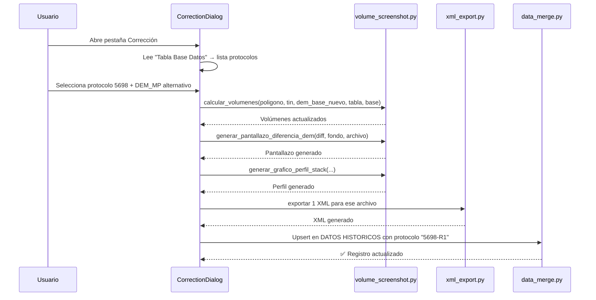
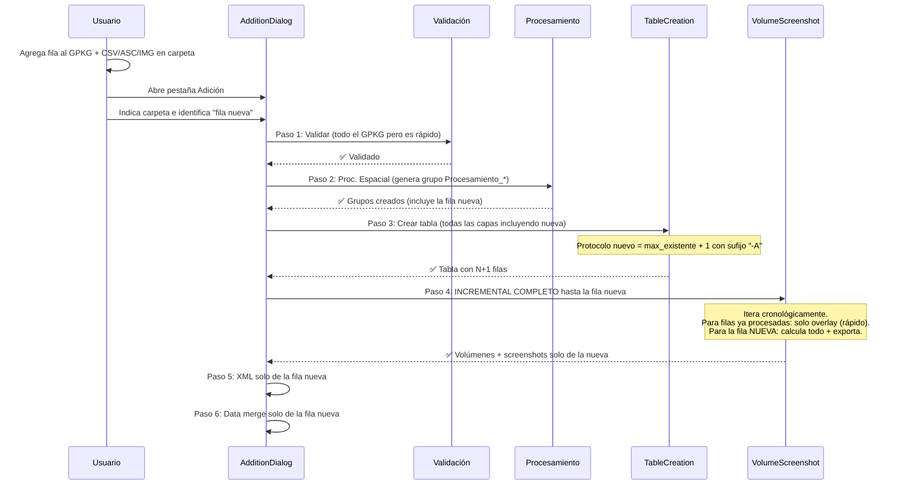

# Análisis Profundo V2: Corrección y Adición de Protocolos

## Resumen Ejecutivo

Dos nuevos flujos operacionales para el plugin, diseñados **simplificados** sin tocar el DEM acumulado:

| Flujo | Concepto | Sufijo |
|---|---|---|
| **Corrección** (`-R`) | Re-calcular un protocolo existente contra un DEM base seleccionado por el usuario | `5698-R1` |
| **Adición** (`-A`) | Agregar un protocolo faltante a un mes cerrado, corriendo el pipeline incremental hasta esa fila | `1050-A` |

---

## Requisito Transversal: Protocolos Alfanuméricos

> [!IMPORTANT]
> Hoy el campo `Protocolo Topografico` se maneja como `int` en todo el código. Debe pasar a `string` para soportar sufijos como `-R1` y `-A`. Hay **4 puntos del código** que deben cambiar:

### Puntos de cambio (campo protocolo como string)

| # | Archivo | Función | Líneas | Qué hace hoy | Qué debe hacer |
|---|---|---|---|---|---|
| 1 | [pipeline_dialog.py](file:///c:/Users/LT_Gabinete_1/AppData/Roaming/QGIS/QGIS3/profiles/default/python/plugins/PLUGIN_Canchas_Las_Tortolas/gui/pipeline_dialog.py#L295-L328) | `_determinar_protocolo_inicial` | 295-328 | `int(val)` para encontrar max | Extraer parte numérica con regex, ignorar sufijos |
| 2 | [table_creation.py](file:///c:/Users/LT_Gabinete_1/AppData/Roaming/QGIS/QGIS3/profiles/default/python/plugins/PLUGIN_Canchas_Las_Tortolas/core/table_creation.py#L425-L471) | `_get_historical_protocol_mapping` | 425-471 | `int(val)` para mapear protocolos | Extraer parte numérica, mapear como string |
| 3 | [table_creation.py](file:///c:/Users/LT_Gabinete_1/AppData/Roaming/QGIS/QGIS3/profiles/default/python/plugins/PLUGIN_Canchas_Las_Tortolas/core/table_creation.py#L108-L146) | `crear_tabla_base_datos` | 108-146 | Campo protocolo como `QVariant.Int` | Cambiar a `QVariant.String` |
| 4 | [data_merge.py](file:///c:/Users/LT_Gabinete_1/AppData/Roaming/QGIS/QGIS3/profiles/default/python/plugins/PLUGIN_Canchas_Las_Tortolas/core/data_merge.py#L142-L332) | `fusionar_datos_historicos` | 142-332 | No filtra por tipo de protocolo | Sin cambios (ya copia como está) |

### Lógica de extracción numérica

```python
import re

def extraer_numero_protocolo(val):
    """
    '5698'    → 5698
    '5698-R1' → 5698
    '1050-A'  → 1050
    None      → 0
    """
    if val is None:
        return 0
    match = re.match(r'^(\d+)', str(val).strip())
    return int(match.group(1)) if match else 0
```

**Ejemplo de coexistencia:**
```
Protocolos existentes: 1000, 1001-A, 1001, 1002-R1
max numérico = max(1000, 1001, 1001, 1002) = 1002
Siguiente protocolo normal = 1003
```

---

## Caso 1: CORRECCIÓN DE PROTOCOLO (`-R`)

### Concepto simplificado (Opción C)

El usuario abre el `.qgz` del mes donde está el protocolo con error. El plugin:
1. Lee la "Tabla Base Datos" del proyecto para listar los protocolos existentes
2. El usuario selecciona cuál corregir y qué DEM base usar
3. **Solo se recalculan**: volúmenes, pantallazo diferencia, perfil stack, XML
4. **NO se toca el DEM acumulado** (no overlay_patch)
5. Se genera una "Tabla Base Datos Correccion" con la fila corregida
6. Se actualiza DATOS HISTORICOS: el protocolo `5698` se renombra a `5698-R1`

### Flujo técnico detallado



### Qué módulos se reutilizan (sin modificar)

| Módulo | Función | ¿Se puede llamar unitariamente? |
|---|---|---|
| `volume_screenshot.py` | `calcular_volumenes()` | ✅ Sí — recibe args individuales |
| `volume_screenshot.py` | `generar_pantallazo_diferencia_dem()` | ✅ Sí |
| `volume_screenshot.py` | `generar_grafico_perfil_stack()` | ✅ Sí |
| `volume_screenshot.py` | `calculate_difference()` | ✅ Sí |
| `xml_export.py` | Exportar 1 archivo | ⚠️ Necesita modo unitario (hoy itera todos) |
| `data_merge.py` | `fusionar_datos_historicos()` | ✅ Ya tiene upsert por `(Fecha, Muro, Sector, Nombre)` |

### UI propuesta (nueva pestaña/ventana simple)

```
┌─────────────────────────────────────────────┐
│     🔧 CORRECCIÓN DE PROTOCOLO              │
├─────────────────────────────────────────────┤
│                                             │
│  📋 Seleccionar protocolo a corregir:       │
│     [ ▼ 5698 | 260202_MP_S6_TALUD_PATA ]   │
│                                             │
│  🗺️ Modelo base para recálculo:             │
│     [ ▼ DEM_MP / DEM_ME / DEM_MO / otro ]  │
│                                             │
│     [ ▶ EJECUTAR CORRECCIÓN ]               │
│                                             │
│  📋 Consola de operación...                 │
│                                             │
└─────────────────────────────────────────────┘
```

### Archivos nuevos necesarios
- `gui/correction_dialog.py` — La ventana UI
- `core/correction_processor.py` — Orquesta el flujo reducido

---

## Caso 2: ADICIÓN DE PROTOCOLO OLVIDADO (`-A`)

### Concepto del usuario (entendido)

> "Abrir el proyecto, agregar el nuevo elemento al GPKG de levantamiento original + su CSV/ASC e imagen. En la pestaña, *avisar* cuál es la fila nueva. El pipeline corre **todo el proceso incremental** hasta esa fila para obtener los valores correctos, y al final exportar el protocolo solo de esa fila."

### ¿Por qué correr todo el proceso incremental?

Porque el Paso 4 (`ejecutar_calculo_volumenes_con_pantallazos`) funciona así:

```python
# Ordena todas las bases cronológicamente
sorted_bases = sorted(fecha_base_map.keys(), key=lambda x: fecha_base_map.get(x, datetime.min))

# Para cada base, en orden:
for base in sorted_bases:
    # 1. Calcula volúmenes contra DEM actual
    # 2. Genera pantallazo
    # 3. PEGA el TIN sobre el DEM (incremental) ← CLAVE
    # → El DEM se va modificando progresivamente
```

Cada cancha se pega sobre el DEM, alterando el terreno para la siguiente. Si la cancha olvidada tiene fecha de Marzo y cronológicamente va en la posición 25 de 50, **necesitas que las 24 anteriores ya hayan sido pegadas** para que los volúmenes sean correctos contra el DEM acumulado hasta ese punto.

### Flujo propuesto: "Pipeline hasta fila N"



### El truco: "modo adición" en el Paso 4

El Paso 4 es el más pesado. Hoy recalcula TODO para todas las filas. Para la adición podemos optimizar:

```python
# MODO ADICIÓN — Pseudo-código
for base in sorted_bases:
    if base == fila_objetivo:
        # ESTA es la nueva → calcular volúmenes + pantallazo + perfil + overlay  
        calcular_volumenes(...)
        generar_pantallazo(...)
        generar_perfil(...)
        overlay_patch_onto_dem(...)  # SÍ pegar (es dato nuevo, no corrección)
    elif base in filas_ya_procesadas:
        # Ya existe → solo hacer overlay para actualizar el DEM acumulado
        overlay_patch_onto_dem(...)  # Solo pegar, sin calcular nada
    else:
        # Nueva también pero no es la objetivo → ¿no debería pasar?
        pass
```

Esto hace que las ~49 filas anteriores solo "peguen" su parche (rápido, ~2 seg c/u) y la fila nueva sea la única que calcula volúmenes, screenshots, etc.

### Puntos críticos del Paso 4 en modo adición

| Aspecto | Detalle |
|---|---|
| **Tiempo estimado** | ~2 min para overlay de las filas anteriores + ~30 seg para la nueva |
| **DEM se modifica** | ✅ Sí, y está bien porque es un dato NUEVO que faltaba |
| **Necesita todos los TINs?** | Solo los TINs de las filas anteriores para recrear el DEM incremental. Si el `.qgz` los tiene cargados, perfecto |
| **Si el `.qgz` NO tiene los TINs** | Se necesitaría re-ejecutar Paso 2 para regenerarlos desde los CSV/ASC |

### UI propuesta (pestaña simple)

```
┌─────────────────────────────────────────────┐
│     ➕ ADICIÓN DE PROTOCOLO FALTANTE        │
├─────────────────────────────────────────────┤
│                                             │
│  📂 Carpeta de procesamiento:               │
│     [ C:\...\02_OPERACIONES\2026\03_Marzo ] │
│                                             │
│  📂 Levantamiento GPKG (ya con fila nueva): │
│     [ C:\...\levantamiento.gpkg           ] │
│                                             │
│  📂 Carpeta CSV/ASC e Imágenes:             │
│     [ C:\...\NUBE_ARCHIVOS                ] │
│                                             │
│  🆕 Nombre del archivo nuevo:               │
│     [ ▼ 260315_MP_S2_CANCHA_OLVIDADA      ] │
│     (Auto-detectado: filas no presentes     │
│      en DATOS HISTORICOS)                   │
│                                             │
│     [ ▶ EJECUTAR ADICIÓN ]                  │
│                                             │
│  📋 Consola de operación...                 │
│                                             │
└─────────────────────────────────────────────┘
```

### Archivos nuevos necesarios
- `gui/addition_dialog.py` — La ventana UI
- `core/addition_processor.py` — Orquesta el pipeline "hasta fila N"

---

## Mapa de cambios completo

### Cambios a código existente (bajo riesgo)

| Archivo | Cambio | Impacto |
|---|---|---|
| `table_creation.py` L135 | Campo protocolo: `QVariant.Int` → `QVariant.String` | ⚠️ Las tablas futuras serán string |
| `table_creation.py` L449-460 | `_get_historical_protocol_mapping`: usar `extraer_numero_protocolo()` | Bajo |
| `pipeline_dialog.py` L313-322 | `_determinar_protocolo_inicial`: usar `extraer_numero_protocolo()` | Bajo |
| `pipeline_dialog.py` L337 | `QSpinBox` → `QSpinBox` (mantener, solo muestra el numérico) | Ninguno |
| `volume_screenshot.py` | Agregar param `modo_adicion` + `fila_objetivo` al método principal | Medio |
| `xml_export.py` | Agregar modo "archivo único" | Bajo |

### Código nuevo

| Archivo | Propósito | Tamaño est. |
|---|---|---|
| `gui/correction_dialog.py` | UI de corrección | ~200 líneas |
| `core/correction_processor.py` | Orquestador corrección | ~150 líneas |
| `gui/addition_dialog.py` | UI de adición | ~250 líneas |
| `core/addition_processor.py` | Orquestador adición | ~200 líneas |

---

## Preguntas para decidir

1. **¿Dónde van los botones de Corrección y Adición?** ¿Nuevos botones en la ventana principal del pipeline? ¿O un menú separado en el toolbar de QGIS?

2. **Para la Adición: ¿el usuario agrega manualmente la fila al GPKG antes de abrir la pestaña?** (Eso entendí — el usuario edita el GPKG de levantamiento existente en QGIS, agrega la fila, copia el ASC/CSV/IMG a la carpeta, y luego ejecuta la adición.)

3. **El DATOS HISTORICOS maestro (`00_CAPAS_BASE_ESTATICAS`), ¿se actualiza automáticamente al final de ambos flujos?** ¿O el usuario copia manualmente?

4. **¿Implementamos primero Corrección (más simple) y después Adición?** Así probamos el sistema de protocolos alfanuméricos primero.
