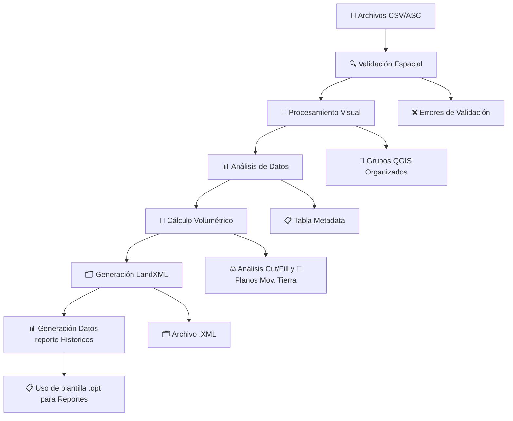

# 🏟️ Canchas Las Tortolas - Plugin QGIS Profesional


**Plugin especializado para procesamiento topográfico integral de canchas Las Tortolas desarrollado por Linkapsis**

> 🚀 **Automatiza completamente** el flujo de trabajo topográfico desde validación hasta reportes finales con exportación LandXML

---

## 📸 Plugin


---

## ⭐ Características Principales

### 🔍 **1. Validación Espacial Avanzada**
- ✅ Verificación automática de formato CSV/ASC
- ✅ Validación de sistemas de coordenadas (EPSG:32719)
- ✅ Control de integridad espacial de archivos
- ✅ Detección de errores de formato topográfico

### 🔄 **2. Procesamiento Visual Inteligente**
- 🎯 Generación automática de grupos QGIS organizados por fecha
- 🔺 Creación de TIN (Triangulated Irregular Network)
- 📐 Generación de polígonos a partir de puntos topográficos
- 🎨 Simbología automática por categorías

### 📊 **3.1 Análisis de Datos Completo**
- 📋 Extracción automática de vértices extremos
- 📈 Generación de tabla base con metadata completa
- 🔢 Análisis estadístico de elevaciones
- 📍 Cálculo de coordenadas de referencia

### 📏 **3.2 Cálculo Volumétrico Profesional**
- ⚖️ Análisis incremental Cut/Fill con DEM base
- 📊 Cálculo de volúmenes con precisión topográfica
- 📐 Determinación de espesores mínimos y máximos
- 📈 Reportes estadísticos detallados

  ### 🗂️ **3.3 Exportación LandXML**
- 📤 Exportación completa a formato LandXML estándar
- 🔺 Superficies TIN con metadatos completos
- 📊 Compatibilidad con software CAD/topográfico
- ✅ Validación automática de exportación

### 📸 **4. Generación Semi-Automática de Reportes**
- 🖼️ Pantallazos automáticos con prefijo "P"
- 📄 Exportación a formato PDF profesional
- 🔍 Factor de zoom configurable (1.3x por defecto)
- 🎨 Layout automático optimizado


---

## 🔄 Flujo de Trabajo Completo




## 📈 Resultados Generados

### **🎯 Grupos QGIS Organizados**

*[Placeholder para screenshot de grupos generados en QGIS]*

```
Procesamiento_YYYY-MM-DD/
├── 📍 Puntos/
│   ├── Levantamiento_001_puntos
│   ├── Levantamiento_002_puntos
│   └── ...
├── 📐 Polígonos/
│   ├── Levantamiento_001_poligono
│   ├── Levantamiento_002_poligono
│   └── ...
└── 🔺 Triangulaciones/
    ├── Levantamiento_001_TIN
    ├── Levantamiento_002_TIN
    └── ...
```

### **📋 Tabla Base de Datos con Metadata**


| Campo | Tipo | Descripción |
|-------|------|-------------|
| `id_levantamiento` | Integer | ID único del levantamiento |
| `fecha_procesamiento` | Date | Fecha de procesamiento |
| `norte_min/max` | Double | Coordenadas extremas Norte |
| `este_min/max` | Double | Coordenadas extremas Este |
| `cota_min/max` | Double | Elevaciones extremas |
| `area_2d` | Double | Área proyectada (m²) |
| `area_3d` | Double | Área superficie real (m²) |
| `num_puntos` | Integer | Cantidad de puntos |
| `archivo_origen` | Text | Nombre archivo CSV original |

### **⚖️ Análisis Volumétrico Cut/Fill**

```
Levantamiento: 001
================
Volumen Cut:    +1,234.56 m³
Volumen Fill:   -567.89 m³
Volumen Neto:   +666.67 m³
Espesor Mín:    -2.45 m
Espesor Máx:    +3.78 m
Área Análisis:  5,678.90 m²
```

### **📸 Reportes Visuales Automáticos**


### **🗂️ Exportación LandXML Profesional**

```xml
<?xml version="1.0" encoding="UTF-8"?>
<LandXML xmlns="http://www.landxml.org/schema/LandXML-1.2">
  <Project name="Canchas Las Tortolas">
    <Surface name="Levantamiento_001">
      <SourceData>
        <Breaklines>
          <Breakline>
            <PntList3D>345678.25 7543210.50 1245.67 ...</PntList3D>
          </Breakline>
        </Breaklines>
      </SourceData>
      <Definition surfType="TIN">
        <Pnts>
          <P id="1">345678.25 7543210.50 1245.67</P>
          ...
        </Pnts>
        <Faces>
          <F>1 2 3</F>
          ...
        </Faces>
      </Definition>
    </Surface>
  </Project>
</LandXML>
```
### **🗂️ Reporte Final**


---

## 🤝 Soporte

### **📧 Información de Contacto Linkapsis**

**🏢 Empresa:** Linkapsis  
**👨‍💻 Desarrollador:** Tito Ruiz - Analista de Desarrollo y Procesos  
**📧 Email:** [truizh@linkapsis.com](mailto:truizh@linkapsis.com)  
**🌐 Website:** [www.linkapsis.com](https://www.linkapsis.com)  
**📅 Fecha Desarrollo:** Agosto 2025  


<div align="center">

**🏟️ Canchas Las Tortolas Plugin QGIS**  
*Desarrollado con ❤️ por [Linkapsis](https://www.linkapsis.com)*

[](https://github.com/titoruizh/PLUGIN_Canchas_LT/stargazers)
[](https://github.com/titoruizh/PLUGIN_Canchas_LT/network/members)

</div>
