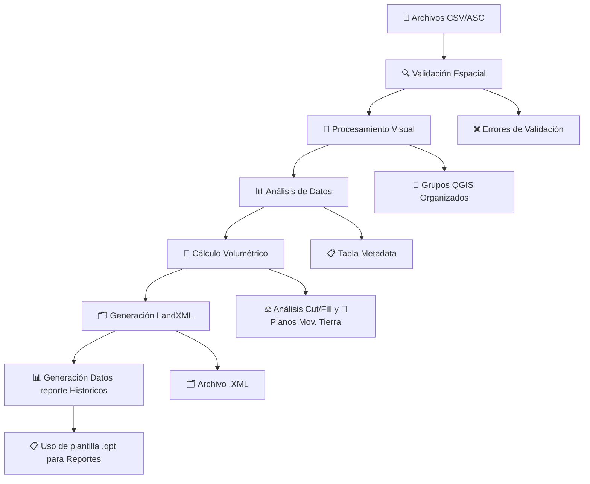

# 🏟️ Canchas Las Tortolas - Plugin QGIS Profesional


**Plugin especializado para procesamiento topográfico integral de canchas Las Tortolas desarrollado por Linkapsis**

> 🚀 **Automatiza completamente** el flujo de trabajo topográfico desde validación hasta reportes finales con exportación LandXML

---

## 📸 Plugin


## 🚀 Ventaja 

## ⚡ Impacto en Tiempos de Procesamiento

| Método                     | Tiempo por cancha |     80 canchas    | Características                                                   |
| :------------------------- | :---------------: | :---------------: | :---------------------------------------------------------------- |
| 🧱 **CAD Manual**          |      8–10 min     |   ≈ **12 horas**  | Procesos manuales, sin reportes automáticos                       |
| ⚙️ **Plugin Automatizado** |   **< 0.1 min**   | **≈ 5 min total** | Resultados completos con reportes, triangulaciones y validaciones |

```
Tiempo total (80 canchas)
───────────────────────────────
CAD Manual        ██████████████████████████████████████  ~12 h
Plugin Automatizado  █  ~5 min
```


📊 **Ahorro estimado:**
🚀 Más de **99% menos tiempo** en procesamiento mensual
💪 **De 12 horas a solo 5 minutos** con reportes y análisis listos


<h2 align="center">🚀 Eficiencia Operacional</h2>

<table align="center">
  <tr>
    <th>Método</th>
    <th>Tiempo por Cancha</th>
    <th>Tiempo Total (80 canchas)</th>
    <th>Ahorro</th>
  </tr>
  <tr>
    <td>🧱 CAD Manual</td>
    <td>8–10 min</td>
    <td>≈ 12 horas</td>
    <td>—</td>
  </tr>
  <tr>
    <td>⚙️ Plugin Automatizado</td>
    <td><strong>&lt; 0.1 min</strong></td>
    <td><strong>≈ 5 min</strong></td>
    <td><strong>−99%</strong></td>
  </tr>
</table>

<p align="center">
  
  
</p>

<p align="center">
  🔥 De procesos manuales en CAD a reportes automáticos en minutos
</p>


---

## ⭐ Características Principales

### 🔍 1. Validación Espacial Avanzada

* ✅ Normalización automática de nombres a mayúsculas
* ✅ Verificación automática de formato CSV/ASC
* ✅ Validación de sistemas de coordenadas (EPSG:32719)
* ✅ Validación inteligente de nomenclatura con GPKG
* ✅ Control de integridad espacial de archivos
* ✅ Filtrado robusto de archivos RTCM / chequeo / INF
* ✅ Detección de errores de formato topográfico
* ✅ Detección y manejo de archivos con múltiples componentes en nombre

### 🔄 2. Procesamiento Visual Inteligente

* 🎯 Generación automática de grupos QGIS con actualización de fecha
* 🔺 Creación de TIN (Triangulated Irregular Network)
* 🔺 Creación de Poligonos
* 🔺 Creación de Puntos
* 📐 Generación de polígonos a partir de puntos topográficos
* 🎨 Simbología automática por categorías

### 📊 3.1 Análisis de Datos Completo

* 📋 Gestión avanzada de tablas con parseo flexible de nombres
* 📋 Extracción automática de vértices extremos
* 📈 Generación de tabla base con metadata completa
* 🔢 Análisis estadístico de elevaciones

### 📏 3.2 Cálculo Volumétrico Profesional + Pantallazos Movimiento de Tierra

* ⚖️ Análisis incremental Cut/Fill con DEM base
* 📊 Cálculo de volúmenes con precisión topográfica
* 📐 Determinación de espesores mínimos y máximos
* 📈 Reportes estadísticos detallados de volúmenes
* 📸 Generación de pantallazos con colores de corte y relleno

### 🗂️ 3.3 Exportación LandXML

* 📤 Exportación completa a formato LandXML con metadatos correctos
* 🔺 Superficies TIN con nomenclatura estandarizada
* 📊 Integración con flujos de trabajo profesionales CAD
* ✅ Compatibilidad total con sistemas de coordenadas **EPSG:32719**

### 📸 4. Generación Semi-Automática de Reportes

* 🖼️ Generacion de nuevas metricas de analisis de datos historicos 
* 📄 Reportes PDF con firma digital y logos corporativos integrados
* 📊 Gráficos de barras (G1) y series temporales (G2) historicos
* 🔥 Heatmaps historicos profesionales
* 📊 Análisis por sector involucrado


---

## 🔄 Flujo de Trabajo Completo




## 📈 Resultados Generados

### **🎯 Grupos QGIS Organizados**

*[Placeholder para screenshot de grupos generados en QGIS]*

```
Procesamiento_YYYY-MM-DD/
├── 📍 Puntos/
│   ├── Levantamiento_001_puntos
│   ├── Levantamiento_002_puntos
│   └── ...
├── 📐 Polígonos/
│   ├── Levantamiento_001_poligono
│   ├── Levantamiento_002_poligono
│   └── ...
└── 🔺 Triangulaciones/
    ├── Levantamiento_001_TIN
    ├── Levantamiento_002_TIN
    └── ...
```

### **📋 Tabla Base de Datos con Metadata**


| Campo | Tipo | Descripción |
|-------|------|-------------|
| `id_levantamiento` | Integer | ID único del levantamiento |
| `fecha_procesamiento` | Date | Fecha de procesamiento |
| `norte_min/max` | Double | Coordenadas extremas Norte |
| `este_min/max` | Double | Coordenadas extremas Este |
| `cota_min/max` | Double | Elevaciones extremas |
| `area_2d` | Double | Área proyectada (m²) |
| `area_3d` | Double | Área superficie real (m²) |
| `num_puntos` | Integer | Cantidad de puntos |
| `archivo_origen` | Text | Nombre archivo CSV original |

### **⚖️ Análisis Volumétrico Cut/Fill**

```
Levantamiento: 001
================
Volumen Cut:    +1,234.56 m³
Volumen Fill:   -567.89 m³
Volumen Neto:   +666.67 m³
Espesor Mín:    -2.45 m
Espesor Máx:    +3.78 m
Área Análisis:  5,678.90 m²
```

### **📸 Reportes Visuales Automáticos**

<!-- Imagen grande arriba -->

<p align="center">
  
</p>

<!-- Tres imágenes pequeñas abajo, alineadas en fila -->

<p align="center">
  
  
  
</p>


### **🗂️ Exportación LandXML Profesional**

```xml
<?xml version="1.0" encoding="UTF-8"?>
<LandXML xmlns="http://www.landxml.org/schema/LandXML-1.2">
  <Project name="Canchas Las Tortolas">
    <Surface name="Levantamiento_001">
      <SourceData>
        <Breaklines>
          <Breakline>
            <PntList3D>345678.25 7543210.50 1245.67 ...</PntList3D>
          </Breakline>
        </Breaklines>
      </SourceData>
      <Definition surfType="TIN">
        <Pnts>
          <P id="1">345678.25 7543210.50 1245.67</P>
          ...
        </Pnts>
        <Faces>
          <F>1 2 3</F>
          ...
        </Faces>
      </Definition>
    </Surface>
  </Project>
</LandXML>
```
### **🗂️ Reporte Final**


---

## 🤝 Soporte

### **📧 Información de Contacto Linkapsis**

**🏢 Empresa:** Linkapsis  
**👨‍💻 Desarrollador:** Tito Ruiz - Analista de Desarrollo y Procesos  
**📧 Email:** [truizh@linkapsis.com](mailto:truizh@linkapsis.com)  
**🌐 Website:** [www.linkapsis.com](https://www.linkapsis.com)  
**📅 Fecha Desarrollo:** Agosto 2025  


<div align="center">

**🏟️ Canchas Las Tortolas Plugin QGIS**  
*Desarrollado con ❤️ por [Linkapsis](https://www.linkapsis.com)*

[](https://github.com/titoruizh/PLUGIN_Canchas_LT/stargazers)
[](https://github.com/titoruizh/PLUGIN_Canchas_LT/network/members)

</div>
