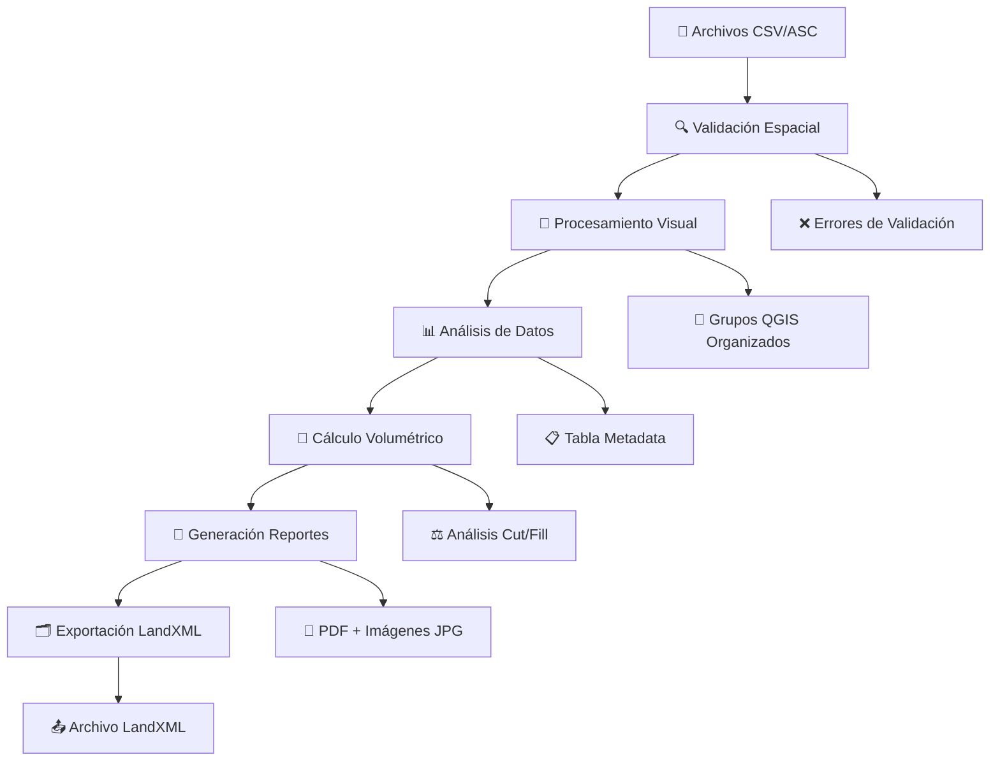

# 🏟️ Canchas Las Tortolas - Plugin QGIS Profesional

[](https://qgis.org)
[](https://github.com/titoruizh/PLUGIN_Canchas_LT)
[](LICENSE)
[](https://python.org)
[](https://pypi.org/project/PyQt5/)

**Plugin especializado para procesamiento topográfico integral de canchas Las Tortolas desarrollado por Linkapsis**

> 🚀 **Automatiza completamente** el flujo de trabajo topográfico desde validación hasta reportes finales con exportación LandXML

---

## 📸 Interface Principal

*[Placeholder para screenshot de la interface principal del plugin]*

---

## ⭐ Características Principales

### 🔍 **1. Validación Espacial Avanzada**
- ✅ Verificación automática de formato CSV/ASC
- ✅ Validación de sistemas de coordenadas (EPSG:32719)
- ✅ Control de integridad espacial de archivos
- ✅ Detección de errores de formato topográfico

### 🔄 **2. Procesamiento Visual Inteligente**
- 🎯 Generación automática de grupos QGIS organizados por fecha
- 🔺 Creación de TIN (Triangulated Irregular Network)
- 📐 Generación de polígonos a partir de puntos topográficos
- 🎨 Simbología automática por categorías

### 📊 **3. Análisis de Datos Completo**
- 📋 Extracción automática de vértices extremos
- 📈 Generación de tabla base con metadata completa
- 🔢 Análisis estadístico de elevaciones
- 📍 Cálculo de coordenadas de referencia

### 📏 **4. Cálculo Volumétrico Profesional**
- ⚖️ Análisis incremental Cut/Fill con DEM base
- 📊 Cálculo de volúmenes con precisión topográfica
- 📐 Determinación de espesores mínimos y máximos
- 📈 Reportes estadísticos detallados

### 📸 **5. Generación Automática de Reportes**
- 🖼️ Pantallazos automáticos con prefijo "P"
- 📄 Exportación a formato PDF profesional
- 🔍 Factor de zoom configurable (1.3x por defecto)
- 🎨 Layout automático optimizado

### 🗂️ **6. Exportación LandXML**
- 📤 Exportación completa a formato LandXML estándar
- 🔺 Superficies TIN con metadatos completos
- 📊 Compatibilidad con software CAD/topográfico
- ✅ Validación automática de exportación

---

## 🔄 Flujo de Trabajo Completo



### **Paso 1: Validación GIS** 🔍
Verificación automática de la integridad espacial y formato de todos los archivos de entrada, asegurando compatibilidad con el sistema de coordenadas EPSG:32719.

### **Paso 2: Procesamiento Visual** 🔄
Generación de capas y grupos QGIS organizados cronológicamente, creación de TIN y polígonos con simbología profesional automática.

### **Paso 3: Análisis de Datos y Volúmenes** 📊
Extracción de coordenadas extremas, metadata completa, análisis volumétrico incremental con cálculos Cut/Fill y generación automática de pantallazos de diferencias DEM.

### **Paso 4: Cálculo de Volúmenes Unificado** 📏📸
Análisis volumétrico incremental comparando con DEM base, cálculo de Cut/Fill, determinación de espesores, generación simultánea de pantallazos regulares y de movimiento de tierras con simbología automática.

### **Paso 5: Generación de Reportes** 📸
Creación automática de imágenes georeferenciadas y reportes PDF con layout profesional optimizado.

---

## 🚀 Instalación Detallada

### **Requisitos del Sistema**

| Componente | Versión Mínima | Recomendada |
|------------|----------------|-------------|
| **QGIS** | 3.28 LTR | 3.34+ |
| **Python** | 3.7 | 3.9+ |
| **PyQt5** | 5.15 | 5.15.7+ |
| **GDAL** | 3.4 | 3.6+ |
| **Sistema Operativo** | Windows 10, Linux Ubuntu 20.04 | Windows 11, Ubuntu 22.04 |

### **Instalación desde GitHub**

#### **Método 1: Descarga Directa**
```bash
# 1. Descargar el plugin
git clone https://github.com/titoruizh/PLUGIN_Canchas_LT.git

# 2. Copiar a directorio de plugins QGIS
# Windows:
cp -r PLUGIN_Canchas_LT "%APPDATA%\QGIS\QGIS3\profiles\default\python\plugins\canchas_las_tortolas"

# Linux:
cp -r PLUGIN_Canchas_LT "~/.local/share/QGIS/QGIS3/profiles/default/python/plugins/canchas_las_tortolas"
```

#### **Método 2: ZIP desde GitHub**
1. 📥 Descargar ZIP desde [GitHub Releases](https://github.com/titoruizh/PLUGIN_Canchas_LT/releases)
2. 📂 Extraer en carpeta de plugins QGIS
3. 🔄 Reiniciar QGIS
4. ✅ Activar plugin en `Complementos > Administrar e instalar complementos`

### **Configuración Inicial**

1. **Abrir QGIS** y verificar que el plugin aparezca en el menú `Complementos`
2. **Configurar rutas** en la primera pestaña del plugin:
   - 📁 **PROC_ROOT**: Directorio de archivos procesados
   - 📄 **GPKG**: Archivo GeoPackage original
   - 📊 **CSV-ASC**: Carpeta con archivos topográficos
   - 🖼️ **Imágenes**: Directorio de imágenes asociadas

---

## ⚙️ Configuración Técnica

### **Parámetros Principales Configurables**

```python
# Configuración de procesamiento
PROC_ROOT = "E:\\CANCHAS_QFIELD\\QGIS PROCESAMIENTO\\Archivos Procesados TERRENO"
PIXEL_SIZE = 0.1                    # Resolución TIN (metros)
NUM_RANDOM_POINTS = 20              # Puntos para análisis estadístico
PANTALLAZO_EXPANSION = 1.3          # Factor zoom para imágenes
TARGET_CRS = "EPSG:32719"          # Sistema coordenadas UTM Zone 19S

# Configuración de exportación
XML_OUTPUT_DIR = "XML_EXPORTS"      # Directorio salida LandXML
PDF_OUTPUT_DIR = "PDF_REPORTS"      # Directorio reportes PDF
SCREENSHOT_PREFIX = "P"             # Prefijo imágenes pantallazos
```

### **Configuración Avanzada**

| Parámetro | Valor por Defecto | Descripción |
|-----------|-------------------|-------------|
| `VALIDATION_TOLERANCE` | 0.001 | Tolerancia validación espacial (m) |
| `TIN_MAX_POINTS` | 10000 | Máximo puntos para triangulación |
| `VOLUME_PRECISION` | 0.01 | Precisión cálculos volumétricos (m³) |
| `IMAGE_DPI` | 300 | Resolución imágenes exportadas |
| `PDF_PAGE_SIZE` | A4 | Tamaño página reportes PDF |

---

## 📖 Uso del Plugin

### **Interface de Usuario con Qt Designer**

*[Placeholder para screenshot de interface completa con pestañas]*

La interface está organizada en **4 pestañas principales**:

#### **🔍 Pestaña 1: Validación**
- Configuración de rutas principales
- Validación de archivos CSV/ASC
- Verificación de integridad espacial
- Reportes de errores y advertencias

#### **🔄 Pestaña 2: Procesamiento**
- Generación de grupos QGIS
- Creación de TIN y polígonos
- Configuración de simbología
- Vista previa de resultados

#### **📊 Pestaña 3: Análisis** (con sub-pestañas)
- **3.1** 📋 Tabla Base: Metadata y coordenadas extremas
- **3.2** �📸 Volúmenes y Pantallazos: Cálculos Cut/Fill incrementales con generación automática de imágenes de diferencias DEM
- **3.3** 🗂️ XML: Exportación formato LandXML

#### **📄 Pestaña 4: Reportes**
- Generación de reportes PDF
- Configuración de layout
- Exportación de documentación

### **Pasos de Configuración**

1. **📁 Configurar Rutas**: Establecer directorios de trabajo en Pestaña 1
2. **🔍 Validar Archivos**: Ejecutar validación completa de datos
3. **🔄 Procesar Datos**: Generar grupos y capas QGIS organizadas
4. **📊 Analizar Resultados**: Revisar metadata y cálculos volumétricos
5. **📸 Generar Reportes**: Crear documentación automática
6. **🗂️ Exportar**: Generar archivos LandXML para CAD

### **Ejemplos de Uso**

```python
# Ejemplo configuración básica
config = {
    'proc_root': 'C:/Proyectos/Canchas/Procesados',
    'gpkg_path': 'C:/Datos/levantamientos.gpkg',
    'csv_folder': 'C:/Datos/CSV',
    'img_folder': 'C:/Datos/Imagenes'
}

# Ejecutar validación
resultado_validacion = plugin.ejecutar_validacion()

# Procesar datos espaciales
resultado_procesamiento = plugin.ejecutar_procesamiento()

# Generar reportes
resultado_reportes = plugin.ejecutar_reportes()
```

---

## 📁 Formatos de Entrada

### **📊 Archivos CSV - Formato Topográfico**

```csv
id,norte,este,cota,descripcion
1,7543210.50,345678.25,1245.67,BM-01
2,7543215.30,345685.40,1246.12,EST-02
3,7543220.10,345692.55,1245.89,PT-03
```

**Campos requeridos:**
- `id`: Identificador único numérico
- `norte`: Coordenada Norte UTM (EPSG:32719)
- `este`: Coordenada Este UTM (EPSG:32719)  
- `cota`: Elevación en metros sobre nivel del mar
- `descripcion`: Descripción del punto topográfico

### **🗺️ Archivos ASC - Rasters ASCII**

```
ncols         100
nrows         100
xllcorner     345600.0
yllcorner     7543200.0
cellsize      1.0
NODATA_value  -9999
1245.5 1245.7 1245.9 1246.1 ...
```

**Especificaciones:**
- Formato ASCII Grid estándar
- Sistema coordenadas: EPSG:32719
- Resolución recomendada: 0.1m - 1.0m
- Valores NODATA: -9999

### **🖼️ Imágenes Asociadas**

- **Formato**: JPG, PNG
- **Resolución**: Mínimo 1920x1080
- **Nomenclatura**: Relacionada con ID levantamiento
- **Georreferenciación**: Opcional pero recomendada

---

## 📈 Resultados Generados

### **🎯 Grupos QGIS Organizados**

*[Placeholder para screenshot de grupos generados en QGIS]*

```
Procesamiento_YYYY-MM-DD/
├── 📍 Puntos/
│   ├── Levantamiento_001_puntos
│   ├── Levantamiento_002_puntos
│   └── ...
├── 📐 Polígonos/
│   ├── Levantamiento_001_poligono
│   ├── Levantamiento_002_poligono
│   └── ...
└── 🔺 Triangulaciones/
    ├── Levantamiento_001_TIN
    ├── Levantamiento_002_TIN
    └── ...
```

### **📋 Tabla Base de Datos con Metadata**

*[Placeholder para screenshot de tabla de datos]*

| Campo | Tipo | Descripción |
|-------|------|-------------|
| `id_levantamiento` | Integer | ID único del levantamiento |
| `fecha_procesamiento` | Date | Fecha de procesamiento |
| `norte_min/max` | Double | Coordenadas extremas Norte |
| `este_min/max` | Double | Coordenadas extremas Este |
| `cota_min/max` | Double | Elevaciones extremas |
| `area_2d` | Double | Área proyectada (m²) |
| `area_3d` | Double | Área superficie real (m²) |
| `num_puntos` | Integer | Cantidad de puntos |
| `archivo_origen` | Text | Nombre archivo CSV original |

### **⚖️ Análisis Volumétrico Cut/Fill**

```
Levantamiento: 001
================
Volumen Cut:    +1,234.56 m³
Volumen Fill:   -567.89 m³
Volumen Neto:   +666.67 m³
Espesor Mín:    -2.45 m
Espesor Máx:    +3.78 m
Área Análisis:  5,678.90 m²
```

### **📸 Reportes Visuales Automáticos**

- **Imágenes JPG**: Prefijo "P" + ID levantamiento
- **Resolución**: 300 DPI para impresión profesional
- **Zoom**: Factor 1.3x automático para contexto óptimo
- **Georeferenciación**: Incluida en metadatos EXIF

### **🗂️ Exportación LandXML Profesional**

```xml
<?xml version="1.0" encoding="UTF-8"?>
<LandXML xmlns="http://www.landxml.org/schema/LandXML-1.2">
  <Project name="Canchas Las Tortolas">
    <Surface name="Levantamiento_001">
      <SourceData>
        <Breaklines>
          <Breakline>
            <PntList3D>345678.25 7543210.50 1245.67 ...</PntList3D>
          </Breakline>
        </Breaklines>
      </SourceData>
      <Definition surfType="TIN">
        <Pnts>
          <P id="1">345678.25 7543210.50 1245.67</P>
          ...
        </Pnts>
        <Faces>
          <F>1 2 3</F>
          ...
        </Faces>
      </Definition>
    </Surface>
  </Project>
</LandXML>
```

---

## 🛠️ Troubleshooting

### **❌ Errores Comunes y Soluciones**

#### **Error: "Sistema de coordenadas no válido"**
```
❌ Problema: El archivo CSV no está en EPSG:32719
✅ Solución: Verificar que las coordenadas estén en UTM Zone 19S
           Usar herramientas de reproyección si es necesario
```

#### **Error: "Formato CSV incorrecto"**
```
❌ Problema: Campos faltantes o nombres incorrectos
✅ Solución: Verificar estructura: id,norte,este,cota,descripcion
           Revisar separadores (comas) y codificación (UTF-8)
```

#### **Error: "No se pueden generar triangulaciones"**
```
❌ Problema: Puntos colineales o insuficientes
✅ Solución: Mínimo 3 puntos no colineales por levantamiento
           Verificar distribución espacial de puntos
```

### **🔧 Validación de CRS (EPSG:32719)**

```python
# Verificación automática de sistema de coordenadas
def validar_crs(layer):
    crs_actual = layer.crs().authid()
    if crs_actual != 'EPSG:32719':
        print(f"⚠️ CRS incorrecto: {crs_actual}")
        print("✅ Debe ser: EPSG:32719 (UTM Zone 19S)")
        return False
    return True
```

### **📊 Problemas de Formato de Archivos**

| Problema | Síntoma | Solución |
|----------|---------|----------|
| **Codificación** | Caracteres extraños | UTF-8 sin BOM |
| **Separadores** | Columnas mal leídas | Usar comas (,) |
| **Decimales** | Coordenadas erróneas | Punto (.) no coma (,) |
| **Cabeceras** | Campos no reconocidos | Nombres exactos requeridos |

### **🚨 Mensajes de Log Importantes**

```
✅ INFO: Validación completada exitosamente
⚠️ WARNING: 3 puntos duplicados encontrados
❌ ERROR: Archivo CSV corrupto línea 45
🔍 DEBUG: Procesando levantamiento 001/025
```

---

## 📂 Estructura del Proyecto

```
canchas_las_tortolas/
├── 📁 core/                           # 🧠 Lógica principal de procesamiento
│   ├── __init__.py                    # Inicialización módulos core
│   ├── validation.py                  # 🔍 Validación espacial y formatos
│   ├── processing.py                  # 🔄 Procesamiento visual y TIN
│   ├── table_creation.py              # 📋 Generación tabla metadata
│   ├── volume_calculation.py          # 📏 Cálculos volumétricos
│   ├── screenshot_generation.py       # 📸 Generación automática imágenes
│   ├── xml_export.py                  # 🗂️ Exportación LandXML
│   └── pdf_reports.py                 # 📄 Reportes PDF profesionales
├── 📁 resources/                      # 🎨 Recursos y templates
│   ├── icon.png                       # 🎯 Icono del plugin
│   ├── 📁 templates/                  # 📋 Plantillas reportes
│   ├── 📁 logos/                      # 🏢 Logos corporativos
│   └── 📁 firmas/                     # ✍️ Firmas digitales
├── 📁 ui/                            # 🖥️ Interfaces Qt Designer
│   └── canchas_dialog_base.ui         # 🎨 Diseño interface principal
├── 📄 canchas_dialog.py               # 🖥️ Controlador GUI principal
├── 📄 canchas_las_tortolas.py         # 🚀 Plugin principal QGIS
├── 📄 __init__.py                     # 🔧 Inicialización plugin
├── 📄 resources.py                    # 📦 Recursos compilados Qt
├── 📄 metadata.txt                    # ⚙️ Configuración QGIS
└── 📄 README.md                       # 📖 Este archivo
```

### **🧠 Módulos Core Detallados**

#### **validation.py** 🔍
- Validación espacial de archivos CSV/ASC
- Verificación de sistemas de coordenadas
- Control de integridad de datos topográficos
- Detección de errores de formato

#### **processing.py** 🔄
- Generación de grupos QGIS organizados
- Creación de TIN (Triangulated Irregular Network)
- Procesamiento de polígonos a partir de puntos
- Simbología automática por categorías

#### **table_creation.py** 📋
- Extracción de coordenadas extremas
- Generación de metadata completa
- Cálculos de áreas 2D y 3D
- Análisis estadístico de elevaciones

#### **volume_screenshot.py** �📸
- Módulo unificado de cálculo volumétrico y generación de pantallazos
- Análisis incremental Cut/Fill con pegado automático de TINs sobre DEMs
- Generación simultánea de pantallazos regulares y de diferencias DEM
- Simbología automática para visualización de corte/relleno
- Validación y limpieza de archivos temporales

#### **xml_export.py** 🗂️
- Exportación formato LandXML estándar
- Superficies TIN con metadatos completos
- Compatibilidad software CAD/topográfico
- Validación automática de exportación

---

## 🔧 Tecnologías Utilizadas

### **🌍 Plataforma Geoespacial**

| Tecnología | Versión | Uso Principal |
|------------|---------|---------------|
| **QGIS API** | 3.28+ | Procesamiento geoespacial core |
| **PyQt5** | 5.15+ | Interface gráfica profesional |
| **GDAL/OGR** | 3.4+ | Manipulación raster/vector |
| **Processing Framework** | QGIS Native | Algoritmos geoespaciales |

### **📊 Procesamiento de Datos**

```python
import pandas as pd              # 📈 Análisis datos tabulares
import numpy as np               # 🔢 Cálculos numéricos avanzados
from scipy.spatial import Delaunay  # 🔺 Triangulación Delaunay
import xml.etree.ElementTree as ET   # 🗂️ Procesamiento XML
```

### **🎨 Interface y Reportes**

```python
from PyQt5.QtWidgets import *    # 🖥️ Widgets interface gráfica
from PyQt5.QtCore import *       # ⚙️ Funcionalidades core Qt
from PyQt5.QtGui import *        # 🎨 Elementos gráficos
from reportlab.pdfgen import canvas  # 📄 Generación PDF profesional
```

### **📐 Procesamiento Espacial**

```python
from qgis.core import (
    QgsVectorLayer,              # 📍 Capas vectoriales
    QgsRasterLayer,              # 🗺️ Capas raster
    QgsProject,                  # 📁 Gestión proyecto QGIS
    QgsGeometry,                 # 📐 Geometrías espaciales
    QgsCoordinateReferenceSystem # 🌐 Sistemas coordenadas
)
import processing                # 🔄 Framework procesamiento QGIS
```

### **⚡ Dependencias del Sistema**

```bash
# Dependencias Python requeridas
pip install pandas>=1.3.0
pip install numpy>=1.21.0
pip install scipy>=1.7.0
pip install reportlab>=3.6.0

# Dependencias QGIS (incluidas)
# - PyQt5 >= 5.15.0
# - GDAL >= 3.4.0
# - PROJ >= 8.0.0
```

---

## 🤝 Contribución y Soporte

### **📧 Información de Contacto Linkapsis**

**🏢 Empresa:** Linkapsis  
**👨‍💻 Desarrollador:** Tito Ruiz - Analista de Desarrollo y Procesos  
**📧 Email:** [truizh@linkapsis.com](mailto:truizh@linkapsis.com)  
**🐙 GitHub:** [@titoruizh](https://github.com/titoruizh)  
**🌐 Website:** [www.linkapsis.com](https://www.linkapsis.com)  
**📅 Fecha Desarrollo:** Agosto 2025  

### **🐛 Cómo Reportar Bugs**

1. **🔍 Verificar Issues Existentes**: [GitHub Issues](https://github.com/titoruizh/PLUGIN_Canchas_LT/issues)
2. **📝 Crear Issue Detallado**:
   ```markdown
   ## 🐛 Descripción del Bug
   [Descripción clara y concisa]
   
   ## 🔄 Pasos para Reproducir
   1. Abrir plugin...
   2. Configurar rutas...
   3. Ejecutar validación...
   4. Ver error...
   
   ## ✅ Comportamiento Esperado
   [Qué debería suceder]
   
   ## 🖥️ Información del Sistema
   - QGIS: 3.28.1
   - SO: Windows 11 / Ubuntu 22.04
   - Python: 3.9.7
   ```

3. **📎 Adjuntar Archivos**: Logs, screenshots, archivos de prueba
4. **🏷️ Usar Labels**: `bug`, `enhancement`, `question`

### **✨ Solicitudes de Nuevas Características**

```markdown
## 🚀 Nueva Característica
**Descripción**: [Funcionalidad solicitada]
**Justificación**: [Por qué es necesaria]
**Casos de Uso**: [Ejemplos específicos]
**Prioridad**: Alta/Media/Baja
```

### **🔧 Guía de Contribución**

```bash
# 1. Fork del repositorio
git clone https://github.com/titoruizh/PLUGIN_Canchas_LT.git

# 2. Crear branch para feature
git checkout -b feature/nueva-funcionalidad

# 3. Realizar cambios y commits
git commit -m "feat: agregar nueva funcionalidad XYZ"

# 4. Push y crear Pull Request
git push origin feature/nueva-funcionalidad
```

**📋 Checklist Pull Request:**
- [ ] ✅ Código comentado y documentado
- [ ] 🧪 Tests unitarios incluidos
- [ ] 📖 Documentación actualizada
- [ ] 🎨 Estilo de código consistente
- [ ] 🔍 No hay errores de lint

### **💬 Canales de Soporte**

| Canal | Uso | Tiempo Respuesta |
|-------|-----|------------------|
| **📧 Email** | Soporte técnico profesional | 24-48 horas |
| **🐙 GitHub Issues** | Bugs y características | 1-3 días |
| **💼 Soporte Empresarial** | Contacto directo Linkapsis | 12-24 horas |

---

## 📜 Licencia y Créditos

### **⚖️ Licencia**

```
Canchas Las Tortolas QGIS Plugin
Copyright (C) 2025 Linkapsis

This program is free software: you can redistribute it and/or modify
it under the terms of the GNU General Public License as published by
the Free Software Foundation, either version 2 of the License, or
(at your option) any later version.

This program is distributed in the hope that it will be useful,
but WITHOUT ANY WARRANTY; without even the implied warranty of
MERCHANTABILITY or FITNESS FOR A PARTICULAR PURPOSE. See the
GNU General Public License for more details.

You should have received a copy of the GNU General Public License
along with this program. If not, see <http://www.gnu.org/licenses/>.
```

### **🙏 Créditos y Reconocimientos**

**🏢 Desarrollado por Linkapsis**
- **Empresa:** Linkapsis - Soluciones Tecnológicas Integrales
- **Desarrollador Principal:** Tito Ruiz - Analista de Desarrollo y Procesos
- **Email Corporativo:** [truizh@linkapsis.com](mailto:truizh@linkapsis.com)
- **Sitio Web:** [www.linkapsis.com](https://www.linkapsis.com)

**🛠️ Tecnologías Utilizadas**
- **QGIS Development Team** - Framework geoespacial base
- **Qt Company** - Interface gráfica PyQt5
- **GDAL/OGR Contributors** - Procesamiento geoespacial
- **Python Software Foundation** - Lenguaje de programación
- **SciPy Community** - Algoritmos científicos

**📊 Inspiración y Casos de Uso**
- **Proyecto Canchas Las Tortolas** - Caso de uso real y validación
- **Comunidad Topográfica** - Requerimientos y feedback
- **Usuarios QGIS** - Testing y mejoras continuas

### **📈 Historial de Versiones**

| Versión | Fecha | Características Principales |
|---------|--------|----------------------------|
| **1.0.0** | Agosto 2025 | 🚀 Lanzamiento inicial completo |
| | | ✅ Validación espacial automatizada |
| | | 🔄 Procesamiento visual inteligente |
| | | 📊 Análisis volumétrico profesional |
| | | 📸 Generación reportes automática |
| | | 🗂️ Exportación LandXML estándar |

---

## 🔗 Enlaces Útiles

- **📦 Repositorio GitHub**: [titoruizh/PLUGIN_Canchas_LT](https://github.com/titoruizh/PLUGIN_Canchas_LT)
- **🐛 Issues y Bugs**: [GitHub Issues](https://github.com/titoruizh/PLUGIN_Canchas_LT/issues)
- **📋 Documentación QGIS**: [QGIS Plugin Development](https://docs.qgis.org/3.28/en/docs/pyqgis_developer_cookbook/)
- **🏢 Linkapsis**: [www.linkapsis.com](https://www.linkapsis.com)
- **📧 Soporte Técnico**: [truizh@linkapsis.com](mailto:truizh@linkapsis.com)

---

<div align="center">

**🏟️ Canchas Las Tortolas Plugin QGIS**  
*Desarrollado con ❤️ por [Linkapsis](https://www.linkapsis.com)*

[](https://github.com/titoruizh/PLUGIN_Canchas_LT/stargazers)
[](https://github.com/titoruizh/PLUGIN_Canchas_LT/network/members)

</div>