# 🏟️ Canchas Las Tortolas - Plugin QGIS Profesional


**Plugin especializado para procesamiento topográfico integral de canchas Las Tortolas desarrollado por Linkapsis**

> 🚀 **Automatiza completamente** el flujo de trabajo topográfico desde validación hasta reportes finales con exportación LandXML

---

## 📸 Plugin


---

##⭐ Características Principales

###🔍 1. Validación Espacial Avanzada
✅ Normalización automática de nombres a mayúsculas
✅ Validación inteligente de nomenclatura con GPKG
✅ Filtrado robusto de archivos RTCM/chequeo/inf
✅ Detección y manejo de archivos con múltiples componentes en nombre

###🔄 2. Procesamiento Visual Inteligente
🎯 Generación automática de grupos QGIS con actualización de fecha
🔺 Creación optimizada de triangulaciones con prefijos adecuados
📐 Visualización avanzada con tamaños de fuente 3x más grandes
🎨 Correcciones automáticas de nomenclatura G1/G2/PH en gráficos

###📊 3.1 Análisis de Datos Completo
📋 Gestión avanzada de tablas con parseo flexible de nombres
📈 Manejo robusto de formatos de nombres complejos (4+ componentes)
🔢 Conversión automática de códigos de muro para búsqueda DEM
📍 Extracción precisa de metadatos de fecha y ubicación

###📏 3.2 Cálculo Volumétrico Profesional + Pantallazos Mov. Tierra
⚖️ Cálculos de corte/relleno con precisión de 4 decimales
📊 Análisis de movimiento de tierra con reportes detallados
📐 Determinación de espesores mínimos y máximos
📈 Reportes estadísticos detallados de volúmenes
📸 Generacion de pantallazos con colores de corte y relleno

###🗂️ 3.3 Exportación LandXML
📤 Exportación completa a formato LandXML con metadatos correctos
🔺 Superficies TIN con nomenclatura estandarizada
📊 Integración con flujos de trabajo profesionales CAD/BIM
✅ Compatibilidad total con sistemas de coordenadas EPSG:32719

###📸 4. Generación Semi-Automática de Reportes
🖼️ Sistema de pantallazos con prefijos claros y consistentes
📄 Reportes PDF con firma digital y logos corporativos integrados
📊 Gráficos de barras (G1) y series temporales (G2) con texto ampliado
🔥 Heatmaps profesionales con barras de colores verticales optimizadas


---

## 🔄 Flujo de Trabajo Completo

```mermaid
graph TD
    A[📁 Archivos CSV/ASC] --> B[🔍 Validación Espacial]
    B --> C[🔄 Procesamiento Visual]
    C --> D[📊 Análisis de Datos]
    D --> E[📏 Cálculo Volumétrico]
    E --> F[🗂️ Generación LandXML]
    F --> G[📊 Generación Datos reporte Historicos]
    
    B --> H[❌ Errores de Validación]
    C --> I[🎯 Grupos QGIS Organizados]
    D --> J[📋 Tabla Metadata]
    E --> K[⚖️ Análisis Cut/Fill y 📸Planos Mov. Tierra]
    F --> L[🗂️ Archivo .XML]
    G --> M[📋 Uso de plantilla .qpt para Reportes]
```




## 📈 Resultados Generados

### **🎯 Grupos QGIS Organizados**

*[Placeholder para screenshot de grupos generados en QGIS]*

```
Procesamiento_YYYY-MM-DD/
├── 📍 Puntos/
│   ├── Levantamiento_001_puntos
│   ├── Levantamiento_002_puntos
│   └── ...
├── 📐 Polígonos/
│   ├── Levantamiento_001_poligono
│   ├── Levantamiento_002_poligono
│   └── ...
└── 🔺 Triangulaciones/
    ├── Levantamiento_001_TIN
    ├── Levantamiento_002_TIN
    └── ...
```

### **📋 Tabla Base de Datos con Metadata**


| Campo | Tipo | Descripción |
|-------|------|-------------|
| `id_levantamiento` | Integer | ID único del levantamiento |
| `fecha_procesamiento` | Date | Fecha de procesamiento |
| `norte_min/max` | Double | Coordenadas extremas Norte |
| `este_min/max` | Double | Coordenadas extremas Este |
| `cota_min/max` | Double | Elevaciones extremas |
| `area_2d` | Double | Área proyectada (m²) |
| `area_3d` | Double | Área superficie real (m²) |
| `num_puntos` | Integer | Cantidad de puntos |
| `archivo_origen` | Text | Nombre archivo CSV original |

### **⚖️ Análisis Volumétrico Cut/Fill**

```
Levantamiento: 001
================
Volumen Cut:    +1,234.56 m³
Volumen Fill:   -567.89 m³
Volumen Neto:   +666.67 m³
Espesor Mín:    -2.45 m
Espesor Máx:    +3.78 m
Área Análisis:  5,678.90 m²
```

### **📸 Reportes Visuales Automáticos**


### **🗂️ Exportación LandXML Profesional**

```xml
<?xml version="1.0" encoding="UTF-8"?>
<LandXML xmlns="http://www.landxml.org/schema/LandXML-1.2">
  <Project name="Canchas Las Tortolas">
    <Surface name="Levantamiento_001">
      <SourceData>
        <Breaklines>
          <Breakline>
            <PntList3D>345678.25 7543210.50 1245.67 ...</PntList3D>
          </Breakline>
        </Breaklines>
      </SourceData>
      <Definition surfType="TIN">
        <Pnts>
          <P id="1">345678.25 7543210.50 1245.67</P>
          ...
        </Pnts>
        <Faces>
          <F>1 2 3</F>
          ...
        </Faces>
      </Definition>
    </Surface>
  </Project>
</LandXML>
```
### **🗂️ Reporte Final**


---

## 🤝 Soporte

### **📧 Información de Contacto Linkapsis**

**🏢 Empresa:** Linkapsis  
**👨‍💻 Desarrollador:** Tito Ruiz - Analista de Desarrollo y Procesos  
**📧 Email:** [truizh@linkapsis.com](mailto:truizh@linkapsis.com)  
**🌐 Website:** [www.linkapsis.com](https://www.linkapsis.com)  
**📅 Fecha Desarrollo:** Agosto 2025  


<div align="center">

**🏟️ Canchas Las Tortolas Plugin QGIS**  
*Desarrollado con ❤️ por [Linkapsis](https://www.linkapsis.com)*

[](https://github.com/titoruizh/PLUGIN_Canchas_LT/stargazers)
[](https://github.com/titoruizh/PLUGIN_Canchas_LT/network/members)

</div>
